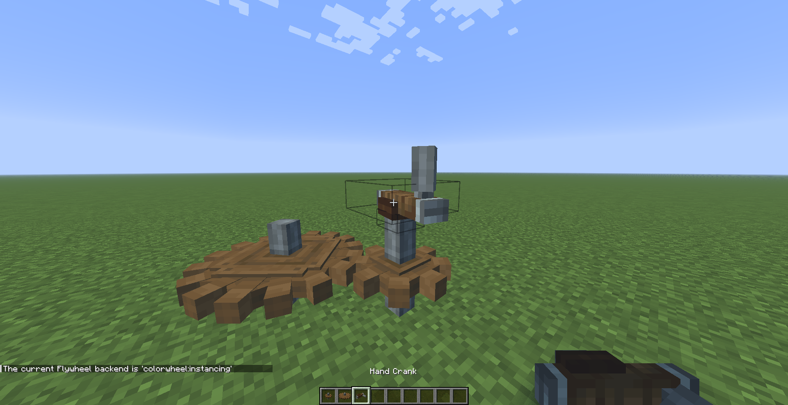
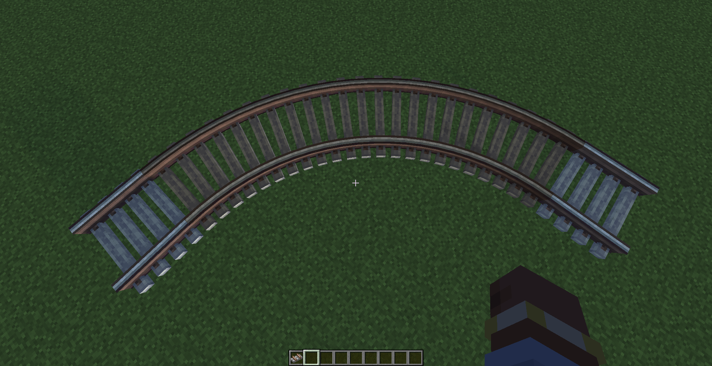

### Gbuffers

The `clrwl_gbuffers` program is most important one, as Colorwheel will reject any shaderpack without it. You don't have to *reinvent the wheel* to create it, you may repurpose one of your existing program. In general, `gbuffers_blocks` serves as a good foundation. For this tutorial, I'll use `gbuffers_terrain` since the reference shaderpack doesn't include `gbuffers_blocks`.  

:::danger
Colorwheel programs **must** use the `compatibility` profile.
:::

Let's copy and rename `gbuffers_terrain.vsh` and `gbuffers_terrain.fsh` to `clrwl_gbuffers.vsh` and `clrwl_gbuffers.fsh` respectively. If we launch the game and select our shaderpack, Colorwheel will no longer complain about our shaderpack being incompatible !  

:::tip
You can check that Colorwheel is active by running the `/flywheel backend` command. The result should be `colorwheel:instancing`. 
:::

Let's try a few blocks from **Create** to test our current version.  



Cogwheels are rendered properly, and rotations are functioning as expected (*yes I know this is a screenshot but trust me*).


Uh, tracks are weird. Let's try at night.



We already have the basics working, but we have some issues with the tracks. This is because we haven't executed the material's fragment, light and cutout shaders, which are essential. 

:::note
Flywheel materials also have shaders that have to be executed in the vertex stage. Those are already being executed before our shader code without us any edit on our part ! This is why the rotations are working, otherwise they would have been static.  
:::

### computeFragment

Colorwheel provides a nice wrapper in the form of the [`clrwl_computeFragment`](/colorwheel/reference/miscellaneous/computefragment.md) function. It is defined as follow:
```glsl
void clrwl_computeFragment(vec4 sampleColor, out vec4 fragColor, out vec2 fragLight, out float ao, out vec4 overlayColor);
```

It takes as input the result of `texture(gtexture, texcoord)` and returns:   
* `fragColor`: the result of `sampleColor * gl_Color`, processed by the material's fragment shader, with the ambient occlusion applied.  
* `fragLight`: the lightmap value, ranging from `0.03125` to `0.96875`, computed by the material's light shader.  
* `ao`: the ambient occlusion value.  
* `overlayColor`: the same as Iris's `entityColor`.  

:::tip
This should be executed as soon as possible, as having the correct values early allows you to keep the rest of your shader code intact.  
:::

Let's fix our fragment shader.  

```diff
#version 330 compatibility

uniform sampler2D lightmap;
uniform sampler2D gtexture;

- uniform float alphaTestRef = 0.1;

in vec2 lmcoord;
in vec2 texcoord;
in vec4 glcolor;
in vec3 normal;

/* RENDERTARGETS: 0,1,2 */
layout(location = 0) out vec4 color;
layout(location = 1) out vec4 lightmapData;
layout(location = 2) out vec4 encodedNormal;

void main() {
-    color = texture(gtexture, texcoord) * glcolor; // biome tint
+    color = texture(gtexture, texcoord);
+    vec2 lmcoord;
+    float ao;
+    vec4 overlayColor;

-    if (color.a < alphaTestRef) {
-        discard;
-    }
+    clrwl_computeFragment(color, color, lmcoord, ao, overlayColor);
+    color.rgb = mix(color.rgb, overlayColor.rgb, overlayColor.a);

    lightmapData = vec4(lmcoord, 0.0, 1.0);
    encodedNormal = vec4(normal * 0.5 + 0.5, 1.0);
}
```

- `color` is now the result of the material's fragment shader, with the ambient occlusion applied and mixed with the overlay color.
- `lmcoord` is now the result of material's light shader.
- `alphaTestRef` has been removed as the correct test is done using the material's cutout shader.  

*But wait, how does `clrwl_computeFragment` know about `gl_Color` ?*

In reality, they are more in/outs that just the four declared. The material's shaders all requires values from the vertex stage. As such, some values are automatically sent from the vertex stage to the fragment stage. The detailed list is available on the [Attributes overview](/colorwheel/reference/attributes/overview/#inouts) page.  

With this fix applied, we can reload the shaderpack and see that the tracks are now properly rendered !


### Shadows

As we haven't declared the `clrwl_shadow` program yet, Flywheel geometries are not currently rendered in the shadow pass. We'll process as we did with `clrwl_gbuffers`: use `shadow` as the foundation and call `clrwl_computeFragment`.

The new `clrwl_shadow.fsh`:

```diff
#version 330 compatibility

uniform sampler2D gtexture;

in vec2 texcoord;
in vec4 glcolor;

layout(location = 0) out vec4 color;

void main() {
-    color = texture(gtexture, texcoord) * glcolor;
-    if(color.a < 0.1) {
-        discard;
-    }
+    color = texture(gtexture, texcoord);
+    vec2 lmcoord;
+    float ao;
+    vec4 overlayColor;
+
+    clrwl_computeFragment(color, color, lmcoord, ao, overlayColor);
}
```

If we reload our shaderpack, we now have our shadows being rendered !


:::tip
For non Create players, here's how you can build a translucent contraption:  

- Place two **cogwheels** upwards.
- Place a **mechanical bearing** on one of the cogwheel, and a **hand crank** on to top of the other.
- Place some **stained glass** on top of the mechanical bearing.
- With a **super glue** in hand: right click on one corner of the stained glass wall, and right click on the opposite corner.
- Look at the side of the mechanical bearing, hold right click and move your mouse to the right to select *Only Place when Anchor Destroyed*.
- Right click on the hand crank.
:::

### Stress test

You might wonder why all this effort is necessary? What are the real benefits of doing all of this?

Let's run `/fill ~ ~ ~ ~31 ~ ~31 create:water_wheel` to spawn 1024 water wheels. With the `colorwheel:instancing` backend, everything runs smoothly. But if your run `/flywheel backend flywheel:off`, you might notice your computer suddenly getting *very* noisy.  

For reference, on my Steam Deck, the performance dropped from an average of 45 fps to 0 fps, so that's *quite* an improvement.

### Going futher

We are now properly rendering opaque geometries, but Flywheel exposes more [transparency modes](https://github.com/Engine-Room/Flywheel/blob/dc5bc8e64976c69b38abb6965d5cd9033e5a8808/common/src/api/java/dev/engine_room/flywheel/api/material/Transparency.java).  

Colorwheel provides more [programs](/colorwheel/reference/miscellaneous/programs/), one for each transparency mode. If the gbuffers program for a transparency mode doesn't exist, `clrwl_gbuffers` will be used instead while retaining their default blending mode. Make sure that every transparency mode will be rendered properly (this is especially true for shaderpacks using a deferred pipeline).

:::tip
As you can see, there's not a huge difference between Colorwheel programs and existing programs. The easiest way to support Colorwheel is to use `#define` to set a flag, then `#include` an existing program containing `#ifdef`s that include the Colorwheel code when required. This allows  you to keep Colorwheel shaders up to date with minimum effort.
:::
