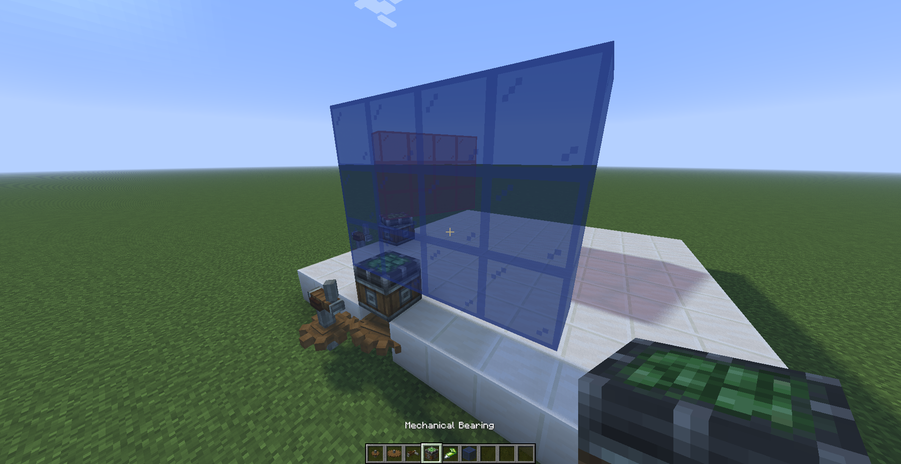
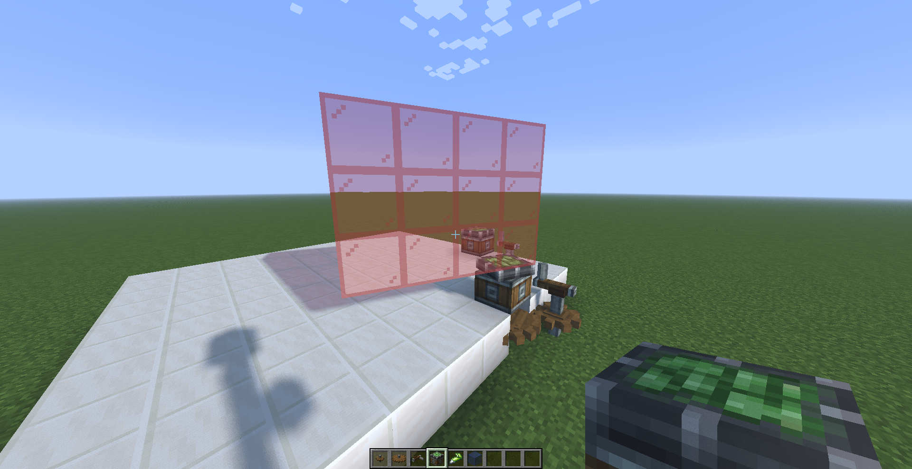
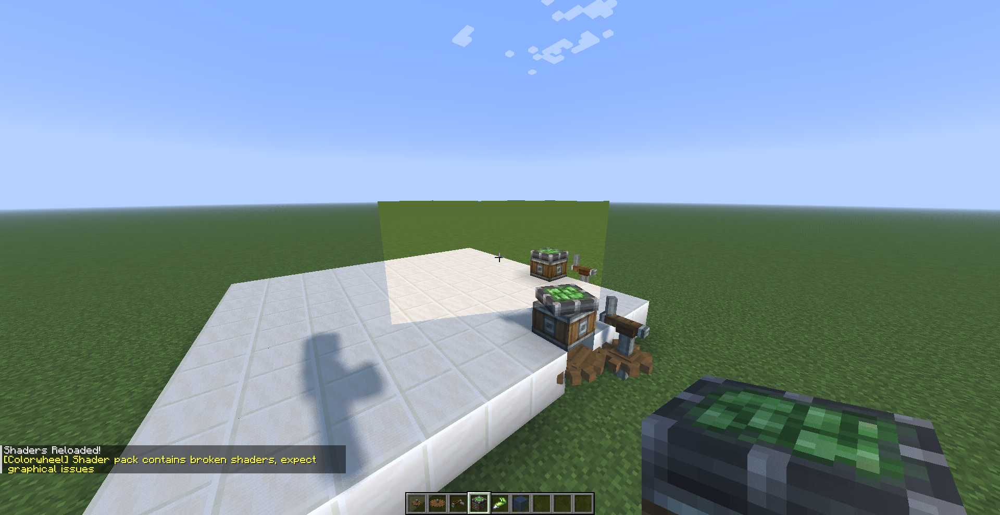
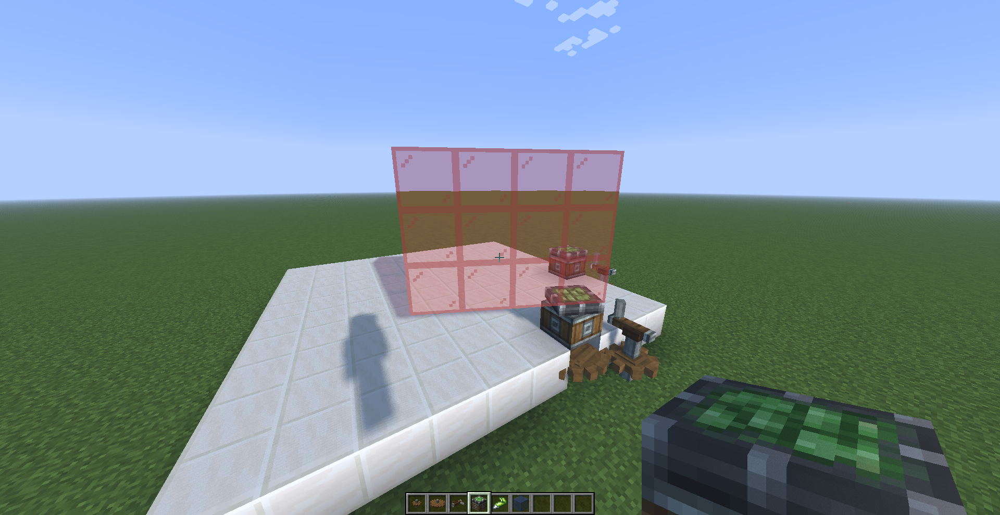
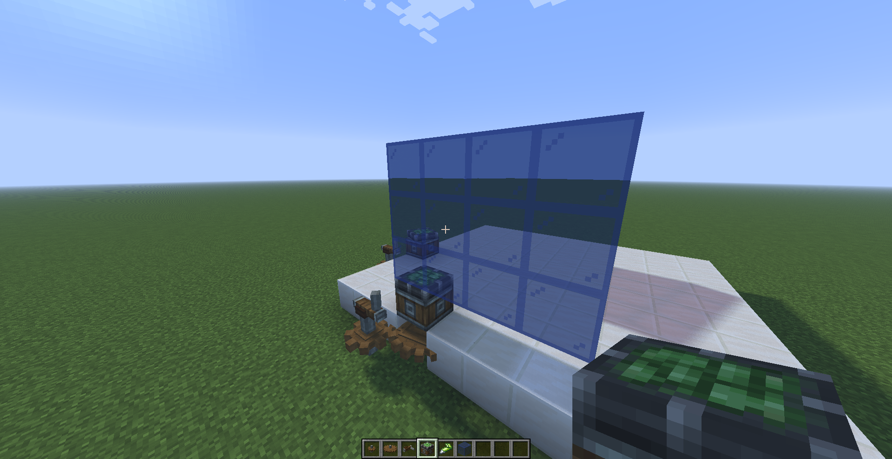
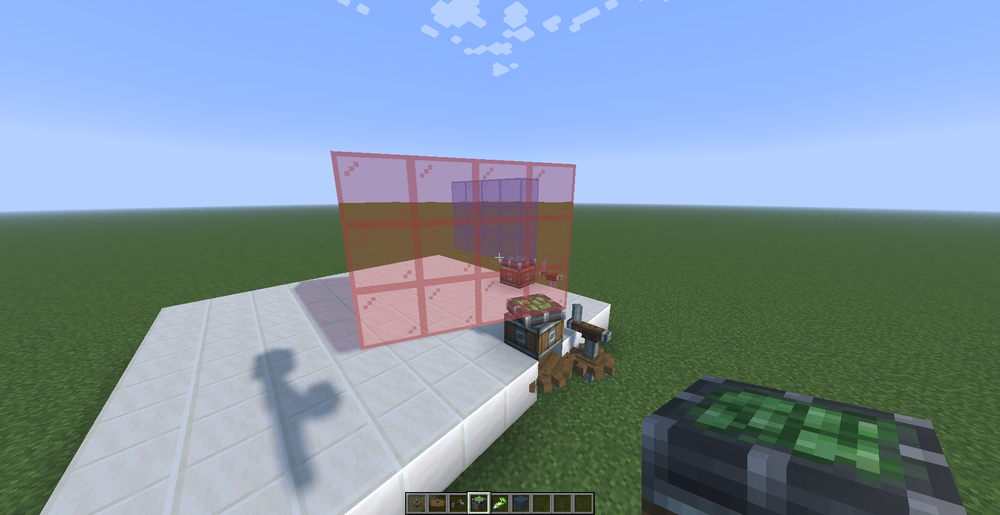
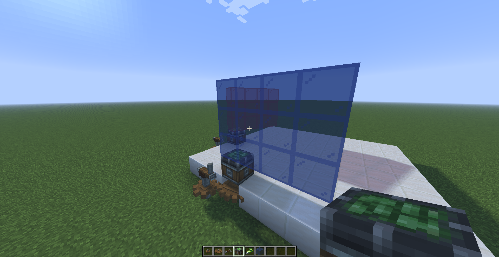

### The Issue

If you play a bit with translucent contraptions, you might encounter the following scenario:



*Yay, it works !*



*Boo, it doesn't work !*

The issue arises because translucent geometries are not sorted: the red glass is rendered first, followed by the blue glass. This works in the first scenario because the red glass is behind the blue glass, but it fails in the second scenario as the red glass occludes the blue glass.

The typical solution to this issue is to sort geometries back-to-front relative to the camera, which is the method used by Iris. However, Flywheel does not sort translucent geometries. Instead, it uses Order Independent Transparency (OIT), which, as the name suggests, does not require geometries to be ordered on the CPU first.

:::caution[Warning]
Before proceding, you **should** read the explanation of [What is Order Independant Transparency ?](/colorwheel/colorwheel/whatis/oit).
:::

### Setup

By default, OIT is disabled and translucent geometries are rendered in whatever order (this is our current situation). To enable it, we must create the [`colorwheel.properties`](/colorwheel/reference/miscellaneous/colorwheelproperties) file and add the following line:

```
oit = true
```

This will enable OIT for both the `gbuffers` and `shadow` render passes. If we reload, we now have ...



... a broken shaderpack !

There are two issues currently:
- We are using `layout(location = N) out vec4 ...`, which is not currently supported (only `gl_FragColor` and `gl_FragData` are supported as of today).
- We haven't declared `DRAWBUFFERS` or `RENDERTARGETS` in `shadow.fsh`, so Colorwheel is unable to determine which buffers are used.

Let's fix `clrwl_gbuffers.fsh`:

```diff
#version 330 compatibility

uniform sampler2D lightmap;
uniform sampler2D gtexture;

in vec2 texcoord;
in vec3 normal;

/* RENDERTARGETS: 0,1,2 */
-layout(location = 0) out vec4 color;
-layout(location = 1) out vec4 lightmapData;
-layout(location = 2) out vec4 encodedNormal;

void main() {
-    color = texture(gtexture, texcoord);
+    vec4 color = texture(gtexture, texcoord);
    vec2 lmcoord;
    float ao;
    vec4 overlayColor;

    clrwl_computeFragment(color, color, lmcoord, ao, overlayColor);
    color.rgb = mix(color.rgb, overlayColor.rgb, overlayColor.a);

-    lightmapData = vec4(lmcoord, 0.0, 1.0);
-    encodedNormal = vec4(normal * 0.5 + 0.5, 1.0);
+    gl_FragData[0] = color;
+    gl_FragData[1] = vec4(lmcoord, 0.0, 1.0);
+    gl_FragData[2] = vec4(normal * 0.5 + 0.5, 1.0);
}
```

And `clrwl_shadow.fsh`:

```diff
#version 330 compatibility

uniform sampler2D gtexture;

in vec2 texcoord;
in vec4 glcolor;

-layout(location = 0) out vec4 color;
+/* RENDERTARGETS: 0 */

void main() {
-    color = texture(gtexture, texcoord);
+    vec4 color = texture(gtexture, texcoord);
    vec2 lmcoord;
    float ao;
    vec4 overlayColor;

    clrwl_computeFragment(color, color, lmcoord, ao, overlayColor);
+
+    gl_FragData[0] = color;
}
```

If we retry:




*It's even worse than before !*

If you recall the OIT explanation, it is mentioned that, by default, all buffers are treated as **frontmost**. This means that only the translucent fragments closest to the camera will be rendered, which is our current situation. We now need to properly configure the OIT.

### Gbuffers

Let's do the inventory of our `colortex` used in `clrwl_gbuffers`, with their alpha value:
- `colortex0`: `RGB16`, stores the color; alpha may vary.
- `colortex1`: `RGBA8`, stores the lightmap; alpha set to 1.0 (opaque).
- `colortex2`: `RGBA8`, stores the normal; alpha set to 1.0 (opaque).

In summary: only `colortex0` is **blended**,`colortex1` and `colortex2` are **opaques**. What we need to do is declare a **coefficient buffer** and assign it to `colortex0`, and set `colortex1` and `colortex2` to **frontmost**. We can also set more suitable image formats to `colortex1` and `colortex2` than the default `RGBA16F`, as we don't need the 16-bit precision. A rank of 3 will be used for the coefficient buffer to provide a good precision level.  

```
oit = true

oit.gbuffers.coefficientRanks = 3

oit.gbuffers.colortex0 = 0

oit.gbuffers.colortex1 = frontmost
oit.gbuffers.colortex1.format = RGBA8

oit.gbuffers.colortex2 = frontmost
oit.gbuffers.colortex2.format = RGBA8
```

:::caution[Warning]
When changing the default format used, make sure to assign a format with an alpha channel.
:::

:::tip
If multiple buffers share the same alpha value, you can reuse the same **coefficients buffer**. This significantly reduces memory usage.
:::




### Shadow

The easiest way to handle shadows is to set all buffers to **frontmost**. This will match current behavior (as blending is disabled in the shadow pass by default), and the shadow color will be determined by the geometry closest to the sun/moon. This will also require less GPU work and less GPU memory compared to a fully utilized OIT.

```
oit.shadow.shadowcolor0 = frontmost
oit.shadow.shadowcolor0.format = RGBA8
```
